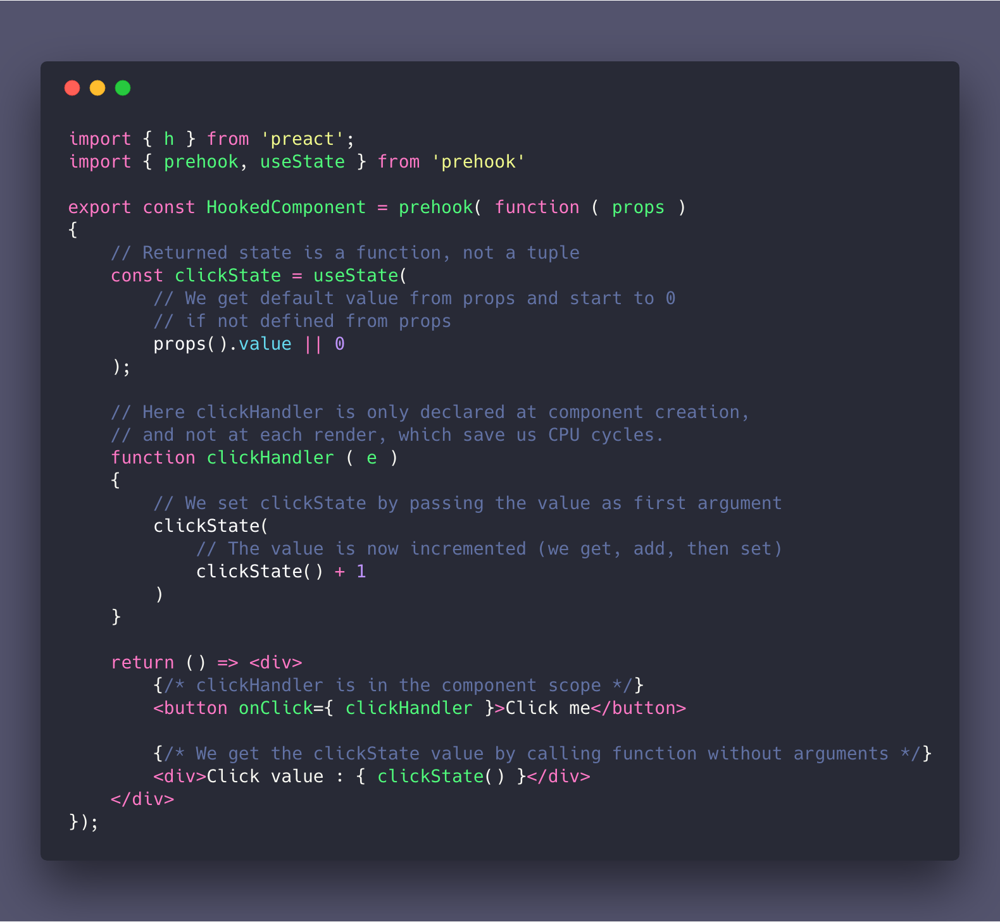
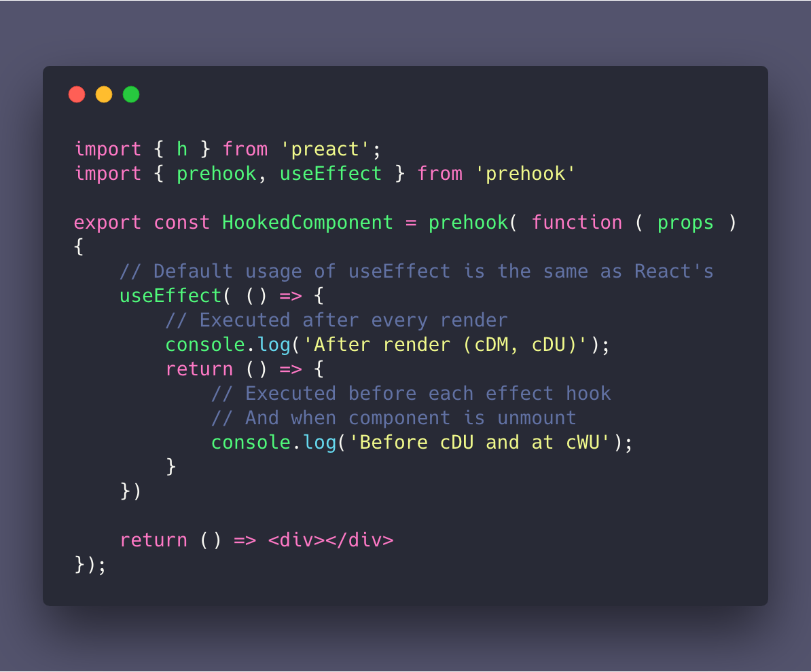
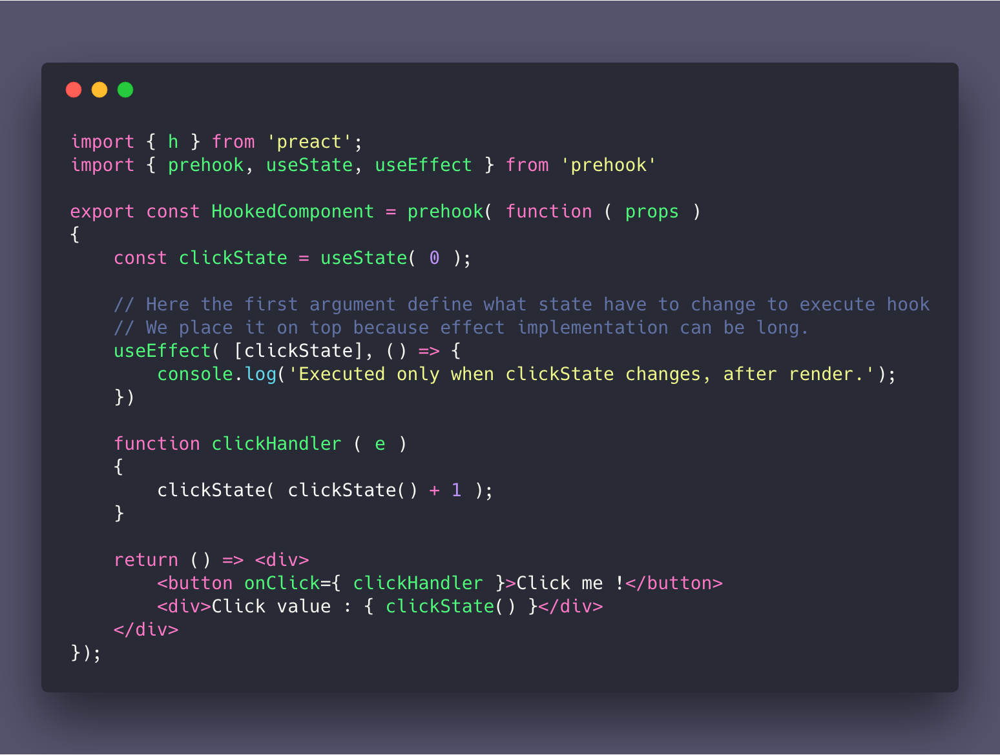

# Prehook (Preact + Hooks) Proof Of Concept
This is a proof of concept of a [React Hooks](https://reactjs.org/docs/hooks-reference.html) like implementation for [Preact](https://preactjs.com/).

## Important !
This is an early Proof of concept for a Hook implementation, **a bit different than the React approach**.
I'm still working on it to have better examples.

### Goal and motivation
1. This is for [Preact](https://preactjs.com/) and the goal is to maintain minimal output size, with maximal code flexibility and execution performaces.
2. I'm not 100% OK with the React Hooks proposal. To much hooks declared inside each render could, I think, lead to performances issues. These performaces issues does not exist with the Class system, so this is a drawback added by hooks we need to avoid.
React as a solution for patching performances with `useMemoization` and `useCallback` hooks but this is overkill with this implementation.
3. Also, the ["don't use hooks in conditions"](https://youtu.be/dpw9EHDh2bM?t=1942) is a problem to me. It shows that there is to much "auto-magic" stuff going on under the hood. Which is not aviced when you dive into a new lib / way of thinking. People need to understands how it works so it's not frustrating. And to me, linters should not be mandatory to use a lib, syntax have to be expressive and clear.

### Size
For now the POC is **2KB not GZip** added to the Preact core with `useState`, `useEffect` and better `useRef`.
This example is **15KB not GZip** with Preact + Prehook + working example.
I plan to add `useReducer` and `useContext` as separated files (like `useRef`).

### Differences
1. Components are still pure functions, but they have 2 phases : Factory and Render phases.
2. Components are not re-executed entierly at each render, they return a render function.
3. Hooks are initialized only at component build time for better performances.
4. Hooks can be inside conditions as long they are inside component's factory phase.
5. `useState` have a slightly different API. With more functional approach.
6. Ref's are more usable with solo refs and multi-refs.
7. `useEffect` update condition are on top of the declaration, before implementation. Small diff but cleaner and more readable code.

No need for React's [useMemo](https://reactjs.org/docs/hooks-reference.html#usememo) and [useCallback](https://reactjs.org/docs/hooks-reference.html#usecallback) for example.
Which help keep our apps **fast and simple**.

### Future
This is built on typescript for now and will be pre-compiled for npm when (if) ready.

I know that Preact's author is working on a [Hooks implementation](https://twitter.com/_developit/status/1057426596779450368).
I also know that Preact goal is to mimic React API's so there is no much chances that is POC is used at anytime by anybody, this is just a proposal :)

Thanks !

## Some examples

The more important aspect of the lib, is the Factory phase and Render phase.
Factory phase scope leak through all the component, but is called once.

States differences.

Use effect example.

Use effect with optimized state example.

*More example to come ...*

### Curious ?

- [See it in action !](https://solid-js.github.io/prehook-proof-of-concept/)

If you just want to check implementation without installing :
Example :
- [App.tsx](https://github.com/solid-js/prehook-proof-of-concept/blob/master/src/App.tsx)
- [HookedComponent.tsx](https://github.com/solid-js/prehook-proof-of-concept/blob/master/src/HookedComponent.tsx)

The lib :
- [prehook.ts](https://github.com/solid-js/prehook-proof-of-concept/blob/master/lib/prehook/prehook.ts)
- [useRef.ts](https://github.com/solid-js/prehook-proof-of-concept/blob/master/lib/prehook/useRef.ts)

## Installation

### Dev mode
Will watch files and check Typescript.
- `node solid` or `npm run dev`

### Build for production
- `node solid production` or `npm run build`
